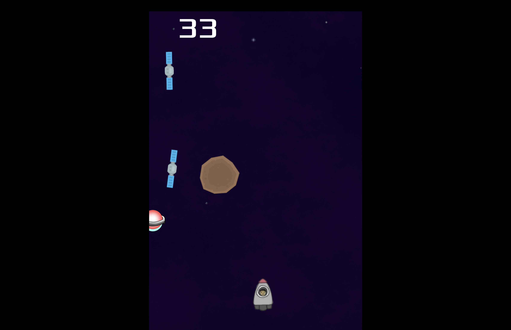

# SpaceEscape @ DYHTG 2024 by Table 36

Do You Have The Guts 2024 Hackathon

Glasgow University Tech Society


# Problem Statement (by J.P. Morgan)
Our challenge this year is to create the most fun game with the least amount of effort from the user.
Options but not limited to:
* Maybe an addictive game (E.g. Flappy Bird) which is only one button or an arcade game using directional buttons
* Maybe a text-based escape room with simple options for the user to pick

There is no right answer here, we want to see what you come up with.


# Game Screenshots

### Start Page


### In Game



# Development

Built with [Godot 4.3](https://godotengine.org/download/archive/4.3-stable/).

## Gesture Recognition Support

### 1. Creating & Activating Python Virtual Environment
```shell
python3.12 -m venv venv/
```
For Windows:
```shell
venv\Scripts\activate
```
For MacOS:
```shell
source venv/bin/activate
```

### 2. Install Dependencies
```
pip install -r requirements.txt
```

### 3. Run Python File
```shell
python main.py
```
(First run may take some time)

### 4. Change Input for SpaceEscape
Toggle boolean flag at [line 6 in player.gd](/player.gd#L6)


# Team Members
* [Aiden Pewar](https://github.com/oeceo)
* [Chelsea Gordon](https://github.com/chelsdan)
* [John Magradey](https://github.com/jmagrad)
* [Lukas Moers](https://github.com/lukasmoers)
* [Siddhartha Dutta](https://github.com/siddydutta)
